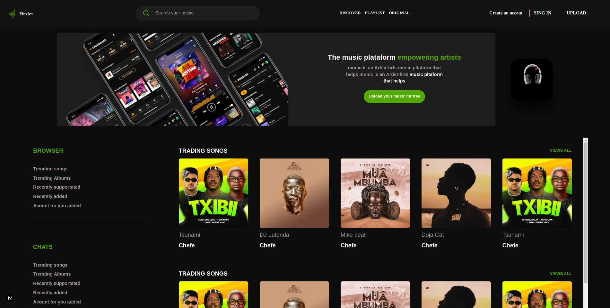

# 🎵 Oncler — Plataforma de Música

<p align="center">
  
</p>


O **Oncler** é uma plataforma online que conecta artistas e ouvintes, permitindo **upload** e **download** de músicas de forma simples e rápida.  
O projeto foi desenvolvido com foco em **experiência do usuário**, **design moderno** e **suporte para artistas independentes**.

---

## 🚀 Funcionalidades

- 📥 **Upload de músicas** para artistas e criadores de conteúdo.
- 📤 **Download** rápido de faixas em alta qualidade.
- 🔍 **Busca inteligente** para encontrar músicas, álbuns e artistas.
- 📈 **Listas de tendências** (Trending Songs e Albums).
- 🆕 **Novidades** com faixas recentemente adicionadas.
- 🎨 **Design responsivo** adaptado para dispositivos móveis e desktop.

---

## 🛠️ Tecnologias Utilizadas

- **Frontend:** React + Next.js + Tailwind CSS
- **Backend:** Node.js + Express
- **Banco de Dados:** MongoDB
- **Armazenamento de Arquivos:** AWS S3
- **Autenticação:** JWT

---

## 📦 Instalação e Uso

```bash
# Clone o repositório
git clone https://github.com/seu-usuario/oncler.git

# Entre na pasta do projeto
cd oncler

# Instale as dependências
npm install

# Inicie o servidor de desenvolvimento
npm run dev
